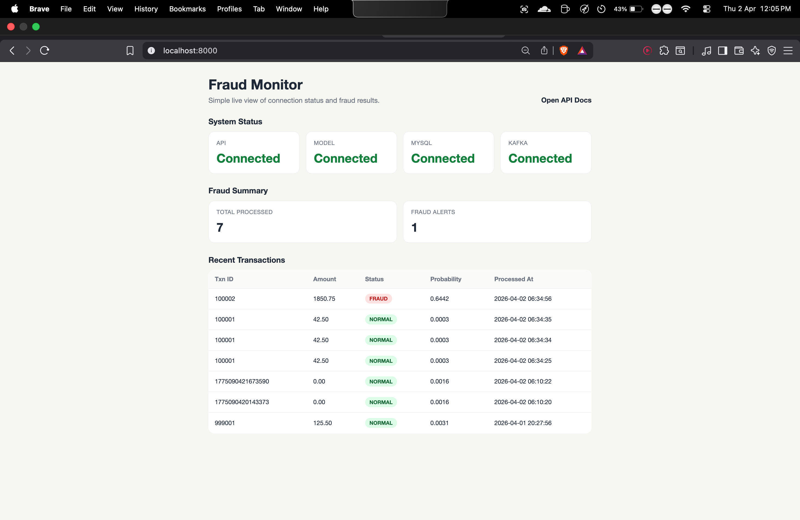
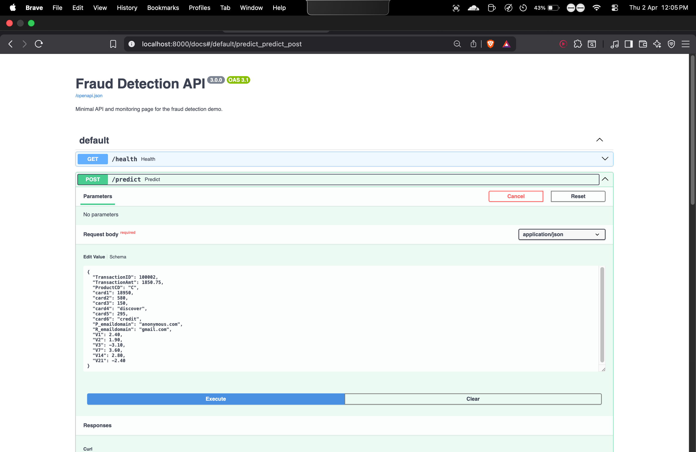
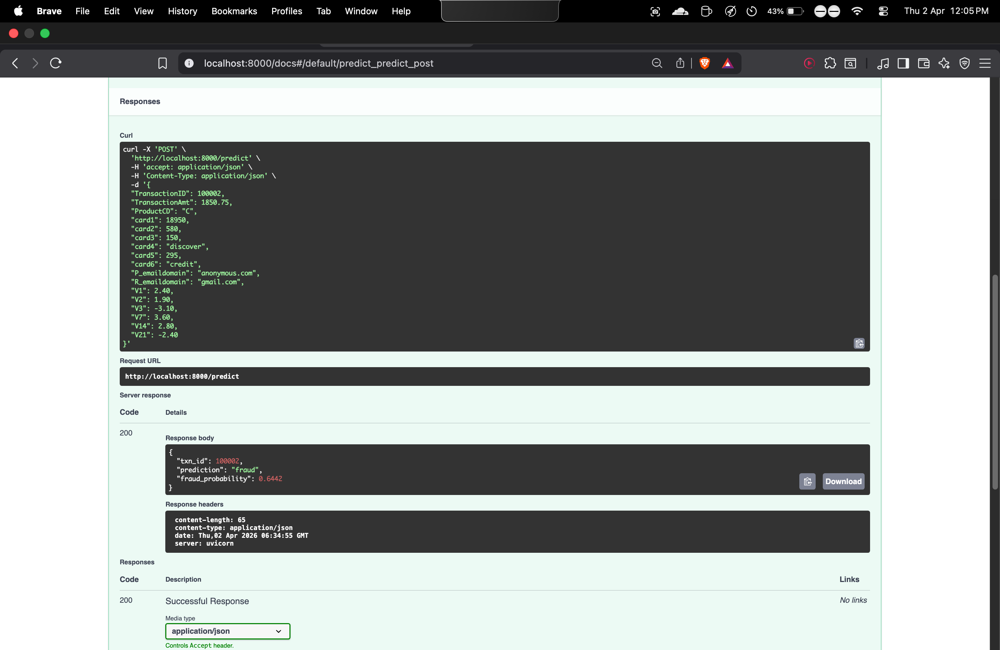

# Real-Time Fraud Detection System

Simple portfolio project that simulates live credit card transactions, scores them for fraud in real time, stores the result, and shows a small monitoring page.

## Demo
### Home Screen


### API / Monitoring


### Prediction Result


## What It Does
- streams transactions in real time
- predicts fraud using an XGBoost model
- stores prediction results in MySQL
- shows a simple monitoring page
- exposes a small FastAPI API for manual testing

## Tech Stack
- Python
- Kafka
- XGBoost
- FastAPI
- MySQL
- Docker Compose

## Run
### Local macOS run
```bash
bash scripts/run_local_macos.sh
```

### Docker run
```bash
docker compose up --build
```

## Main Files
- `train.py` -> trains the fraud model
- `producer.py` -> sends transactions to Kafka
- `consumer.py` -> reads transactions and predicts fraud
- `main.py` -> FastAPI app and monitoring page

## API
- `GET /health`
- `POST /predict`

Docs:
- `http://localhost:8000/docs`

Main page:
- `http://localhost:8000`

## Dataset
This project uses the IEEE-CIS Fraud Detection dataset from Kaggle.

If the real dataset is not available locally, the project can run with a generated demo dataset for testing the full pipeline.

## Note
This is a student portfolio project built to understand streaming systems, fraud detection, and real-time ML deployment.
